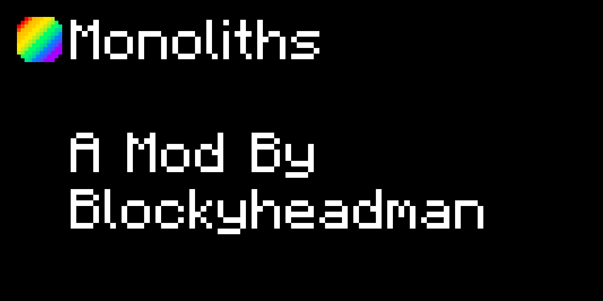

# **Monoliths Mod**
## Made by Blockyheadman (me)

Welcome, to the Monoliths mod!
This mod was originally made for the Veia SMP and the personal server only, but I deceided to make a public version completely serperate to the original. Whatever is in th SMP version is limited to the SMP themselves.

Enjoy the mod! You can download it in the mod's [releases](https://github.com/Blockyheadman/public-monoliths-mod/releases) page.

Hey! if you feel adventurious today, copy the workspace here and customize the mod to what **you** want. After all, I did put this on [GiHub](https://github.com/)

### NOTE: This is a repo for remote workspace on mcreator version 2021.3. I won't be accepting any pull requests here. :(
